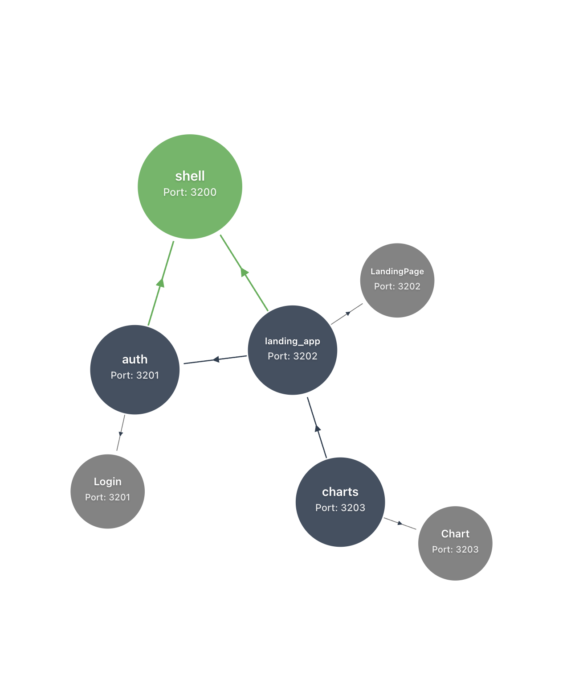

# Installation

```bash
cd <project>
```

```
install dependencies
```

# Running the Applications

Run all applications

#### Auth App

```bash
yarn start:auth
```

#### Landing App

```bash
yarn start:landing_app
```

#### Charts App

```bash
yarn start:charts
```

#### Shell App

```bash
yarn start:shell
```

## Development

- Auth App runs on port 3201
- Landing App runs on port 3202
- Charts App runs on port 3203
- Shell App runs on port 3200

Note: The shell app acts as the host application and should be started last if running apps individually.

## Accessing the Application

Once all applications are running, open your browser and navigate to:

http://localhost:3200

This will load the shell application which coordinates all the micro-frontends together.


Live-Demo: https://lidhium-dashboard-host.web.app

## Application Layout


